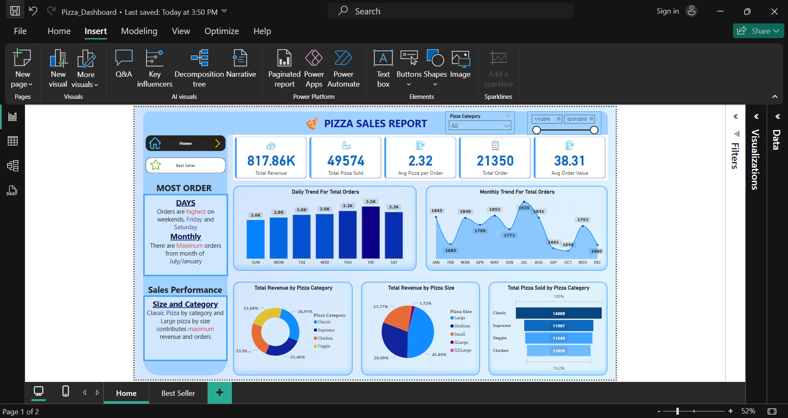
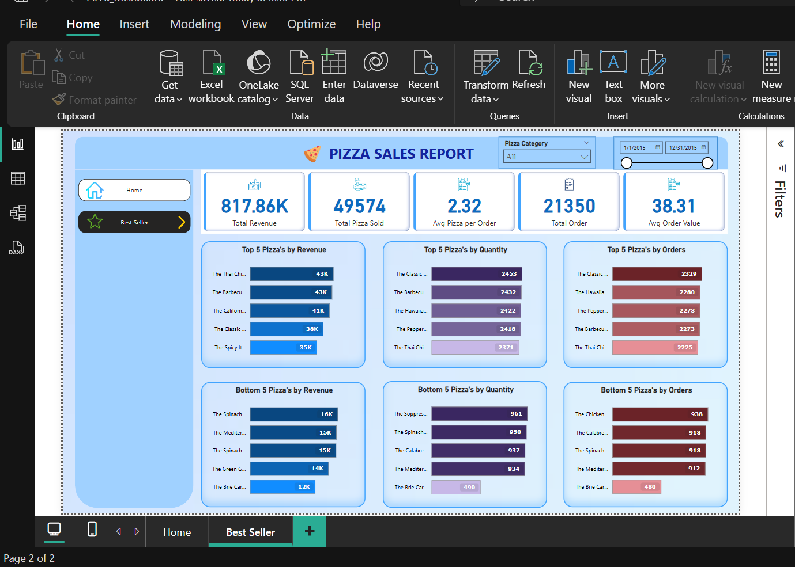

# Pizza Sales Dashboard

This project showcases the creation of an interactive Pizza Sales Dashboard using SQL for data preparation and Power BI for visualization. It demonstrates end-to-end data analysis skills, from data extraction to insightful reporting.

## Dashboard Screenshots

## Project Overview

The dashboard provides a comprehensive view of pizza sales performance. Key features include:

* **Dynamic KPIs:** Displays crucial metrics like total revenue, order counts, and average values.
* **Trend Analysis:** Visualizes daily and monthly order trends.
* **Category and Size Insights:** Breaks down sales by pizza type and size.
* **Interactive Filtering:** Date range sliders for data exploration.
* **User-Friendly Navigation:** Page navigation buttons.
* **Top & Bottom Performers:** Top/bottom 5 pizzas by revenue, quantity, orders.

## Technologies Used

* **SQL:** Data extraction, transformation, loading (ETL).
* **Power BI:** Interactive dashboard and visualizations.

## Project Structure

* **SQL Scripts:** SQL queries for data preparation.
* **Power BI File (.pbix):** Dashboard design and visualizations.
* **README.md:** Project documentation.

## How to Use

1.  Clone the repository.
2.  Open the `.pbix` file in Power BI Desktop.
3.  Interact with the dashboard.
4.  Review SQL scripts.

## Contact

Contact me for questions/feedback.
